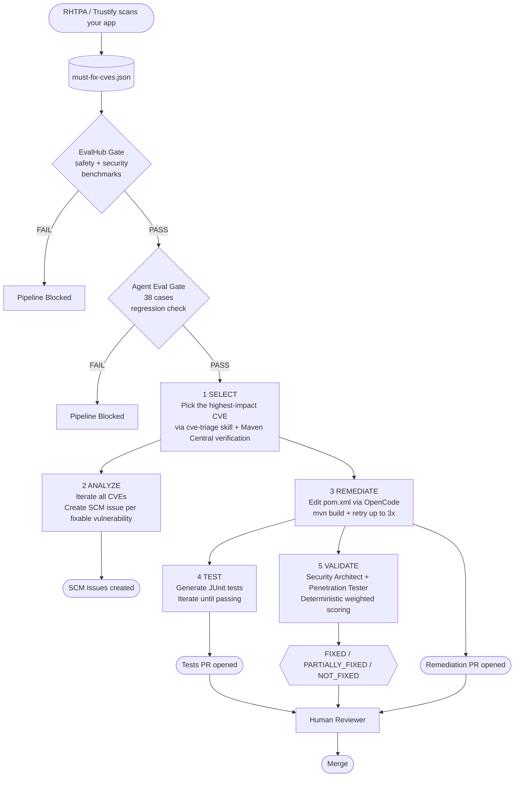

<!-- Logo placeholder: replace with actual Lightwell logo when available -->
<!-- <p align="center"></p> -->

<h1 align="center">lw-agents</h1>

<p align="center">
<strong>AI-accelerated CVE remediation for software supply chain security</strong>
</p>

<p align="center">
<a href="LICENSE"></a>
<a href="https://python.org"></a>
<a href="https://adk.dev/"></a>
<a href="#testing"></a>
</p>

<p align="center">
<a href="docs/architecture.md">Architecture</a> &middot;
<a href="docs/adr/">Decision Records</a> &middot;
<a href="CONTRIBUTING.md">Contributing</a> &middot;
<a href="SECURITY.md">Security</a> &middot;
<a href="CHANGELOG.md">Changelog</a>
</p>

---

Five specialist AI agents that select, analyze, remediate, test, and validate
CVE fixes in open-source dependencies -- then open a pull request. Built on
[Google ADK](https://adk.dev/), deployable on
[Red Hat OpenShift AI](https://www.redhat.com/en/technologies/cloud-computing/openshift/openshift-ai).

> [!NOTE]
> This is a **domain-specific agent application**, not a framework. Google ADK
> provides the agent harness (core loop, tools, state, plugins). Red Hat
> OpenShift AI provides the platform (eval, tracing, deployment). This repo
> provides the CVE remediation domain logic on top.

---

## Why lw-agents?

When Anthropic's Claude Mythos proved that frontier AI could autonomously
discover decades-old zero-day flaws and weaponize them faster than any human
team, **Time To Exploit collapsed to zero**. Manual patch testing became a
relic overnight.

**Lightwell** is IBM and Red Hat's response: AI-accelerated engineering that
backports, validates, and deploys non-breaking open-source patches at machine
speed. This repository is the agent application that powers that engine.

- **Selects** the highest-impact CVE from a policy-gated must-fix set
- **Analyzes** every CVE and files SCM issues for fixable ones
- **Remediates** by editing dependency manifests, verifying builds, and opening PRs
- **Generates** regression tests to prove the fix works
- **Validates** every fix through adversarial multi-persona review with deterministic scoring

> [!TIP]
> You can run the full agent pipeline locally with just a Gemini API key.
> No cluster, no Tekton, no OpenShift required. See [Quick Start](#quick-start).

---

## Who Is This For?

| Persona | How they use lw-agents |
|---|---|
| **Lightwell remediation engineer** | Develops and improves the agent skills, tools, and evaluation datasets that power automated CVE remediation |
| **Security / AppSec engineer** | Integrates lw-agents into CI/CD pipelines so vulnerability fixes are applied automatically when RHTPA scans surface must-fix CVEs |
| **Platform engineer** | Deploys the agent service on OpenShift AI alongside EvalHub, MLflow, and Tekton for production-grade remediation at scale |
| **Contributor / researcher** | Extends the agent with new ecosystem support, skills, or validation personas |

---

## User Journey

How a CVE goes from discovery to a validated pull request:



**Step by step:**

1. **RHTPA scans** your application and produces a vulnerability report with a policy-gated must-fix CVE list
2. **Eval gates** run EvalHub safety/security benchmarks and 38 agent eval cases -- the pipeline only proceeds if both pass
3. **CVE Selection agent** loads the `cve-triage` skill, explores each CVE via tools, verifies versions on Maven Central, and selects the best one to fix
4. **CVE Analysis agent** iterates all CVEs and creates SCM issues for every fixable vulnerability
5. **Remediation agent** loads the `maven-remediation` skill, edits `pom.xml` via OpenCode, runs `mvn install` to verify, retries up to 3 times on failure, then opens a PR
6. **Test Generation agent** writes JUnit tests, iterates until they pass, opens a separate tests-only PR
7. **Fix Validation agent** runs two adversarial personas (security architect + penetration tester) that independently evaluate the fix against 4 weighted gates, producing a deterministic FIXED / PARTIALLY_FIXED / NOT_FIXED verdict
8. **Human reviewer** sees the PR with the fix, the tests, and the validation verdict -- and merges

---

## Key Features

- **Skills-first architecture** -- agent behavior lives in SKILL.md files loaded on demand via ADK's `SkillToolset`, not hardcoded in Python
- **5-layer guardrails** -- SafetyPlugin (LLM-as-judge), RedactionPlugin (secret masking), pre-gate (input validation), post-gate (diff validation), fail-closed scoring
- **Multi-persona adversarial validation** -- security architect + penetration tester personas evaluate fixes with weighted deterministic consensus
- **Retry loops with self-correction** -- `LoopAgent` pipelines retry failed builds up to 3 times, analyzing errors between attempts
- **3-layer evaluation** -- 64 unit tests + 38 agent eval cases + EvalHub safety/security benchmarks
- **MLflow tracing** -- full-stack observability via OpenTelemetry; every LLM call, tool execution, and agent delegation captured as spans
- **Agent-as-a-Service** -- long-lived HTTP service that any CI/CD system can call (not just Tekton)
- **Red Hat MaaS support** -- auto-detects and configures [rh-maas-litellm](https://github.com/rrbanda/rh-maas-litellm) for OpenAI-compatible Gemini proxy on RHOAI

---

## Technology Stack

| Layer | What provides it |
|---|---|
| **Agent harness** | [Google ADK 2.0](https://adk.dev/) -- core loop, tool dispatch, state, context, plugins, MCP, skills |
| **Agent platform** | [Red Hat OpenShift AI](https://www.redhat.com/en/technologies/cloud-computing/openshift/openshift-ai) -- EvalHub, MLflow, Tekton pipelines, deployment |
| **Model serving** | [Gemini API](https://ai.google.dev/) / [Red Hat MaaS](https://github.com/rrbanda/rh-maas-litellm) / [vLLM](https://github.com/vllm-project/vllm) |
| **Agent application** | This repo -- CVE tools, remediation skills, policy gates, scoring, validation |

---

## Quick Start

```bash
# Clone
git clone https://github.com/rrbanda/lw-agents.git
cd lw-agents

# Install (requires uv)
uv sync

# Set up credentials
cp .env.example .env
# Edit .env -- set GEMINI_API_KEY (or MAAS_BASE_URL + MAAS_API_KEY)

# Start the agent server
make dev
# -> http://localhost:8000

# Or open the ADK web playground
make playground
```

> [!NOTE]
> **Requirements:** Python 3.11+ and [uv](https://docs.astral.sh/uv/).
> For MaaS support, also run `uv sync --extra maas`.

---

## How It Works

Five specialist agents behind a coordinator. The coordinator routes by intent;
each specialist loads domain skills on demand and uses tools incrementally.

| Agent | ADK Pattern | What it does |
|---|---|---|
| **CVE Selection** | `LlmAgent` + `SkillToolset` | Loads the `cve-triage` skill, explores must-fix CVEs one-by-one via tools, selects the best one |
| **CVE Analysis** | `LlmAgent` + `SkillToolset` | Loads `cve-analysis` skill, iterates all CVEs, creates SCM issues for fixable ones |
| **Remediation** | `SequentialAgent` + `LoopAgent` | Reads pom.xml, applies fix via OpenCode, verifies Maven build (with retry loop), opens PR |
| **Test Generation** | `SequentialAgent` + `LoopAgent` | Generates JUnit tests via OpenCode, iterates until they pass, opens PR |
| **Fix Validation** | `SequentialAgent` + `BaseAgent` | Two adversarial personas (architect + pentester) evaluate fixes with deterministic weighted scoring |

---

## Model Serving Options

Set the appropriate env vars in `.env`:

| Path | Env vars | Install |
|---|---|---|
| **Gemini API** (simplest, local dev) | `GEMINI_API_KEY` | `uv sync` |
| **Red Hat MaaS** (RHOAI clusters) | `MAAS_BASE_URL` + `MAAS_API_KEY` | `uv sync --extra maas` |
| **vLLM** (self-hosted) | Model endpoint URL via LiteLLM config | `uv sync` |

The MaaS integration uses [rh-maas-litellm](https://github.com/rrbanda/rh-maas-litellm)
to handle tools/response_format conflicts and PDF routing automatically.

---

## Testing

No cluster required. No pipelines. Just an LLM (or nothing at all for unit tests).

```bash
# Unit tests -- no LLM needed (64 tests)
make test

# Lint + format
make lint

# Smoke test -- needs LLM
make run PROMPT="Select the best CVE to remediate. Workspace: /tmp/test"

# Full eval suite -- 38 cases across 6 agents, needs LLM + make dev running
make eval
```

---

## Project Structure

```
lw-agents/
  app/
    agent.py              # Root coordinator + App (ADK entry point)
    config.py             # Shared config: MODEL, WORKSPACE_PATH, MaaS detection
    tracing.py            # MLflow tracing (OTel + LiteLLM autolog)
    callbacks.py          # Structured result extraction for Tekton
    agents/               # 5 specialist agents
    tools/                # CVE exploration + SCM issue/PR tools
    plugins/              # Safety (LLM-as-judge) + Redaction (secret masking)
    policy/               # Pre-gate (validate input) + Post-gate (validate diff)
    scoring/              # Fail-closed CVE selection validation
    eval/                 # EvalHub + MLflow + CVE metrics integration
    models/               # Pydantic data contracts
  skills/                 # 7 ADK skills (SKILL.md + references/)
  tests/                  # Unit tests, eval datasets, behavioral tests
  deployment/tekton/      # Thin HTTP-caller tasks for Tekton pipelines
  docs/adr/               # 11 Architecture Decision Records
```

---

## Skills

Skills are loaded dynamically via ADK's `SkillToolset` with 3-level progressive
disclosure (metadata at startup, instructions on demand, resources when needed).

| Skill | Used by | Purpose |
|---|---|---|
| `cve-triage` | CVE Selection | Methodology for selecting the best CVE |
| `cve-analysis` | CVE Analysis | Methodology for analyzing all CVEs + issue creation |
| `maven-remediation` | Remediation | How to apply Maven dependency bumps |
| `junit-test-generation` | Test Generation | How to generate JUnit 5 tests |
| `scm-conventions` | Multiple agents | Branch naming, PR format, issue templates |
| `validation-architect` | Fix Validation | Security architect review persona |
| `validation-pentester` | Fix Validation | Penetration tester review persona |

---

## MLflow Tracing

Full-stack observability powered by OpenTelemetry + MLflow on RHOAI.
Every LLM call, tool execution, and agent delegation is captured as a span.

```bash
make dev-traced
```

Tracing is **opt-in** (no env var = no tracing) and **gracefully degrades**
(unreachable server = warning log, agents start normally).
See [ADR-011](docs/adr/011-mlflow-tracing.md).

---

## Deployment

```bash
# Build container
podman build -t quay.io/<org>/lw-agents:v1.0.0 .

# Deploy on OpenShift
oc apply -f deployment/tekton/call-agent-task.yaml
```

See [docs/architecture.md](docs/architecture.md) for the full deployment model
including Tekton eval gates and OpenShift namespace layout.

---

## Architecture Decision Records

| ADR | Title |
|-----|-------|
| [001](docs/adr/001-agent-framework-selection.md) | Agent Framework Selection (Google ADK on OpenShift) |
| [002](docs/adr/002-agents-and-skills-first.md) | Agents-and-Skills-First Architecture |
| [003](docs/adr/003-opencode-as-coding-agent.md) | OpenCode as Coding Agent |
| [004](docs/adr/004-tekton-calls-agent-via-api.md) | Tekton Calls Agent via API |
| [005](docs/adr/005-orchestration-pattern-selection.md) | Orchestration Pattern Selection |
| [006](docs/adr/006-safety-at-runner-level.md) | Safety at Runner Level |
| [007](docs/adr/007-policy-gates.md) | Policy Gates Before and After the Agent |
| [008](docs/adr/008-multi-persona-validation.md) | Multi-Persona Fix Validation |
| [009](docs/adr/009-output-redaction.md) | Output Redaction at Runner Level |
| [010](docs/adr/010-evalhub-integration.md) | EvalHub Integration for Safety and Quality Gates |
| [011](docs/adr/011-mlflow-tracing.md) | MLflow Tracing via OpenTelemetry |

---

## Related Projects

- [Google ADK](https://adk.dev/) -- the agent harness powering lw-agents
- [agentic-starter-kits](https://github.com/red-hat-data-services/agentic-starter-kits) -- Red Hat's production-ready agent templates for OpenShift
- [rh-maas-litellm](https://github.com/rrbanda/rh-maas-litellm) -- ADK LiteLLM adapter for Red Hat MaaS

---

## Contact

- **Issues:** [GitHub Issues](https://github.com/rrbanda/lw-agents/issues) for bugs and feature requests
- **Discussions:** [GitHub Discussions](https://github.com/rrbanda/lw-agents/discussions) for questions and ideas
- **Security:** See [SECURITY.md](SECURITY.md) for vulnerability disclosure

## Contributing

See [CONTRIBUTING.md](CONTRIBUTING.md) for development setup, coding conventions,
and how to submit changes.

## License

[Apache License 2.0](LICENSE)
