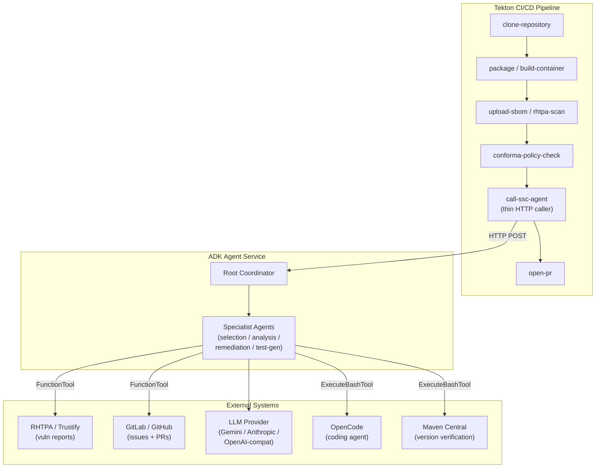
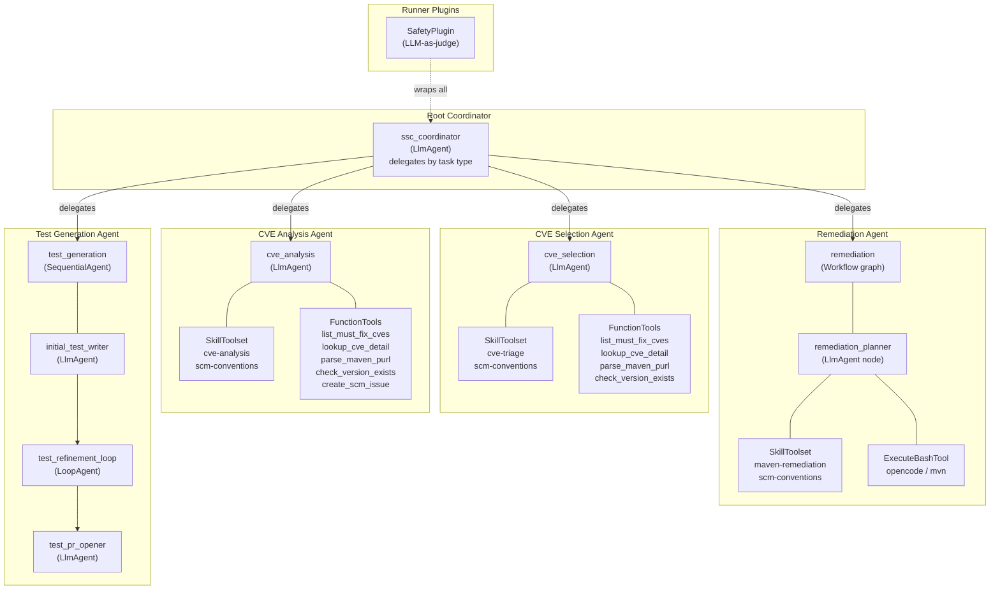
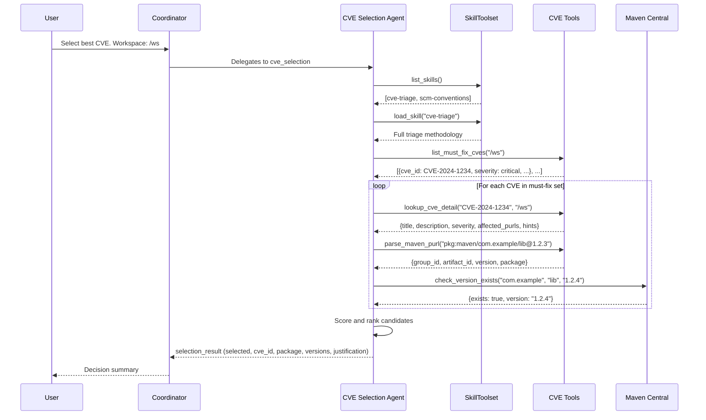
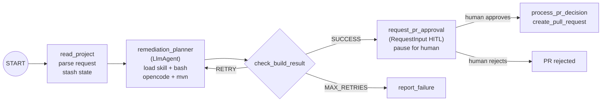
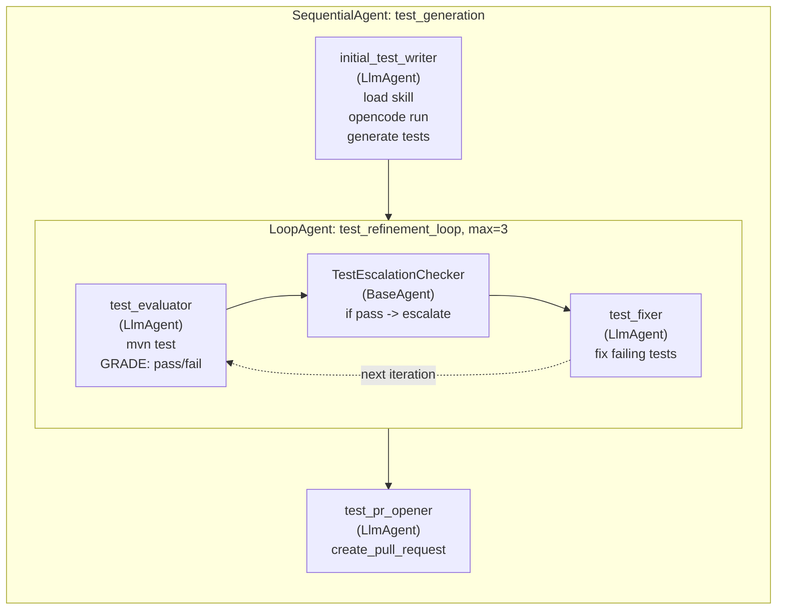
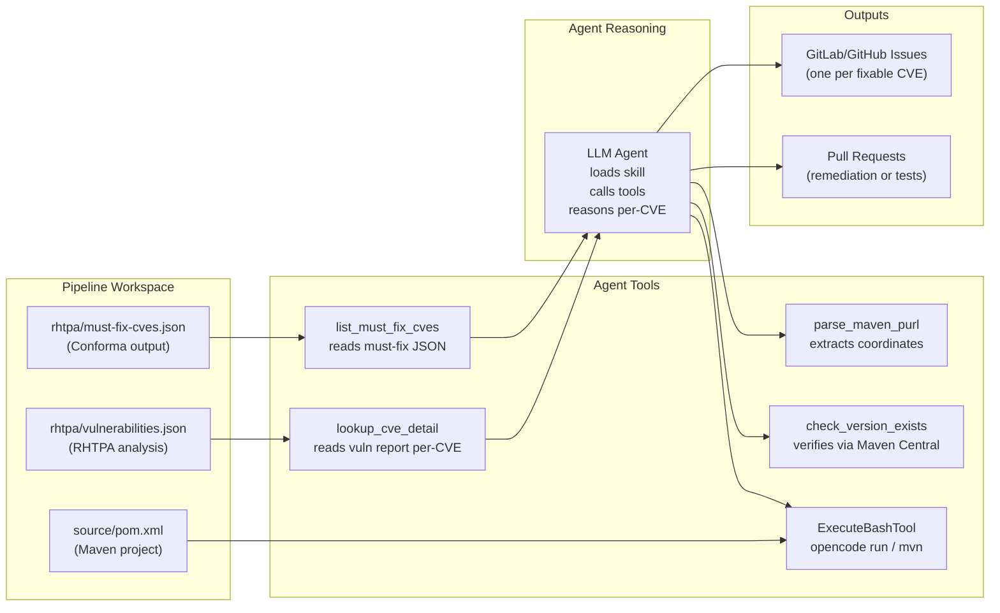
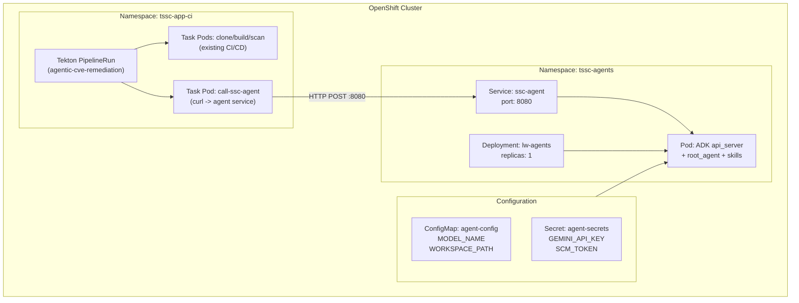

# Architecture

## 1. System Context

How the ADK agent service fits in the broader software supply chain.

## 2. Agent Hierarchy

The coordinator-to-specialist delegation tree with tools and skills.

## 3. CVE Selection Agent Flow

How the CVE selection agent loads a skill, explores CVEs via tools, and decides.

## 4. Remediation Workflow Graph

The Workflow edges, conditional routing, retry loop, and HITL pause.

## 5. Test Generation Pipeline

SequentialAgent with inner LoopAgent for iterative test refinement.

## 6. Data Flow

How data moves from RHTPA workspace files through agent tools to SCM.

## 7. Deployment Architecture

How the ADK agent service is deployed on OpenShift alongside Tekton.

## Architecture Decision Records

See [docs/adr/](adr/) for the full set:

| ADR | Title |
|-----|-------|
| [001](adr/001-agent-framework-selection.md) | Agent Framework Selection (Google ADK on OpenShift) |
| [002](adr/002-agents-and-skills-first.md) | Agents-and-Skills-First Architecture |
| [003](adr/003-opencode-as-coding-agent.md) | OpenCode as Coding Agent |
| [004](adr/004-tekton-calls-agent-via-api.md) | Tekton Calls Agent via API |
| [005](adr/005-orchestration-pattern-selection.md) | Orchestration Pattern Selection |
| [006](adr/006-safety-at-runner-level.md) | Safety at Runner Level |
