# Architecture

## Technology Stack

| Layer | What provides it | Role |
|---|---|---|
| **Agent harness** | [Google ADK 2.0](https://adk.dev/) | Core loop, tool dispatch, state, context management, plugins, MCP, skills |
| **Agent platform** | [Red Hat OpenShift AI](https://www.redhat.com/en/technologies/cloud-computing/openshift/openshift-ai) | EvalHub, MLflow, Tekton pipelines, OpenShift deployment |
| **Model serving** | Gemini API / [Red Hat MaaS](https://github.com/rrbanda/rh-maas-litellm) / vLLM | LLM inference |
| **Agent application** | This repo (lw-agents) | CVE tools, remediation skills, policy gates, scoring, multi-persona validation |

## 1. System Context

How the ADK agent service fits in the broader software supply chain.

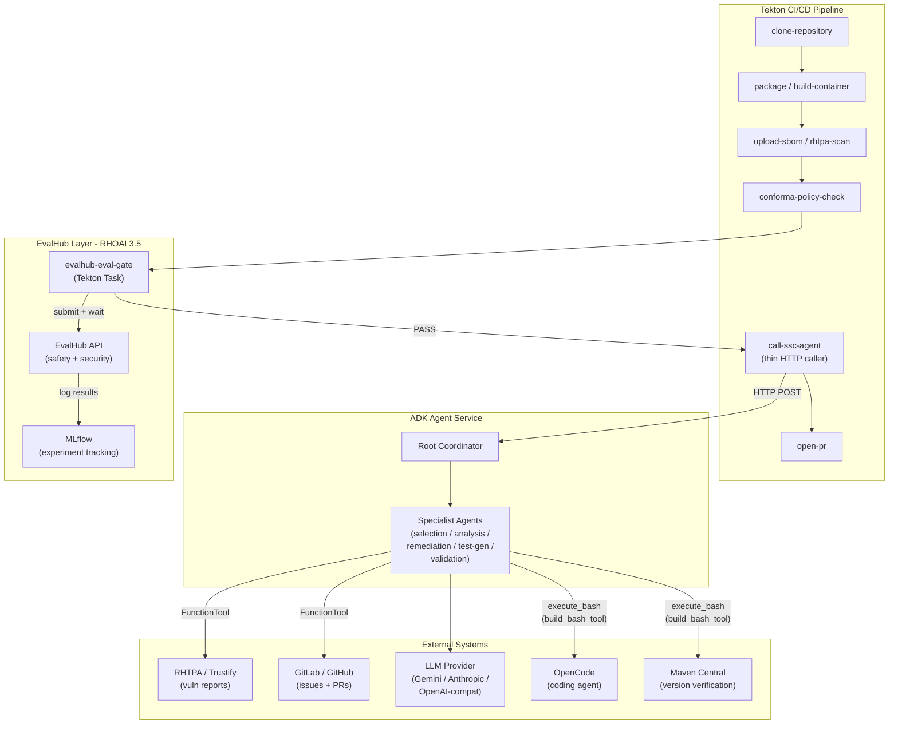

## 2. Agent Hierarchy

The coordinator-to-specialist delegation tree with tools and skills.

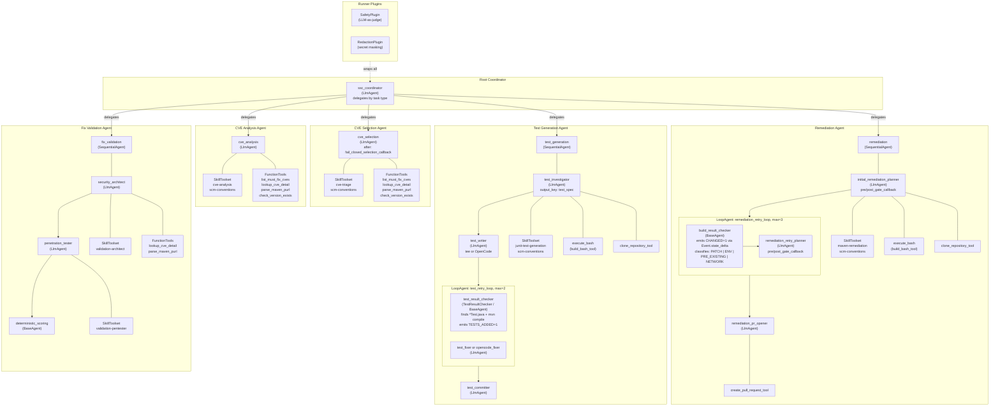

## 3. CVE Selection Agent Flow

How the CVE selection agent loads a skill, explores CVEs via tools, and decides.

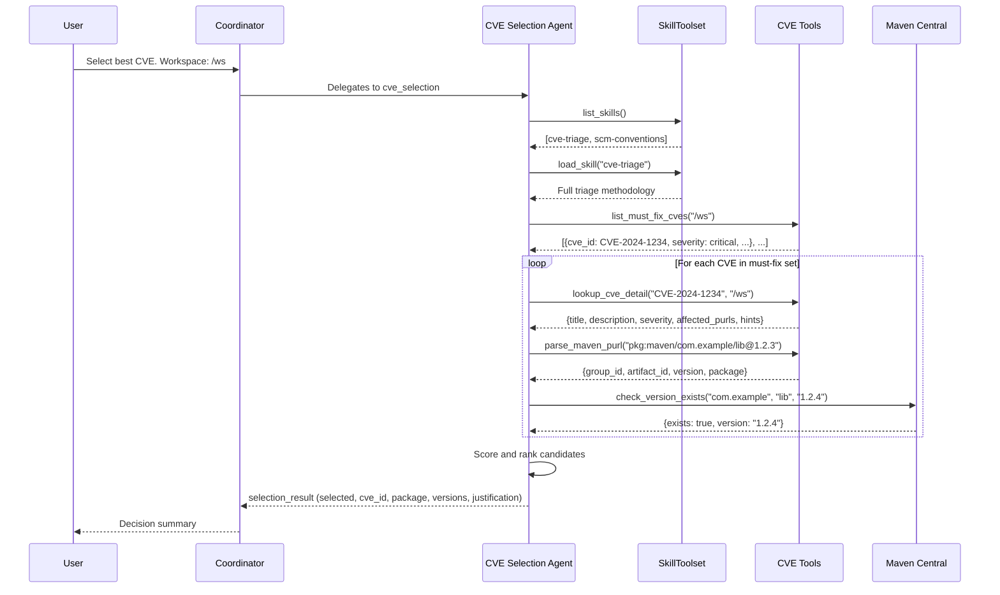

## 4. Remediation Pipeline (SequentialAgent + LoopAgent)

The SequentialAgent pipeline with inner LoopAgent for build-retry logic.

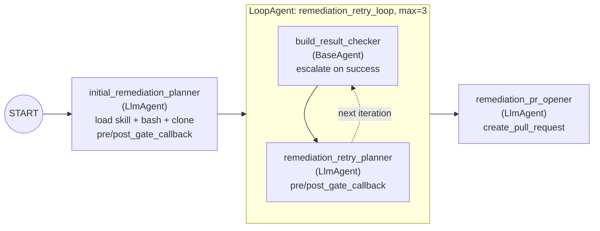

## 5. Test Generation Pipeline

SequentialAgent with inner LoopAgent for iterative test refinement.

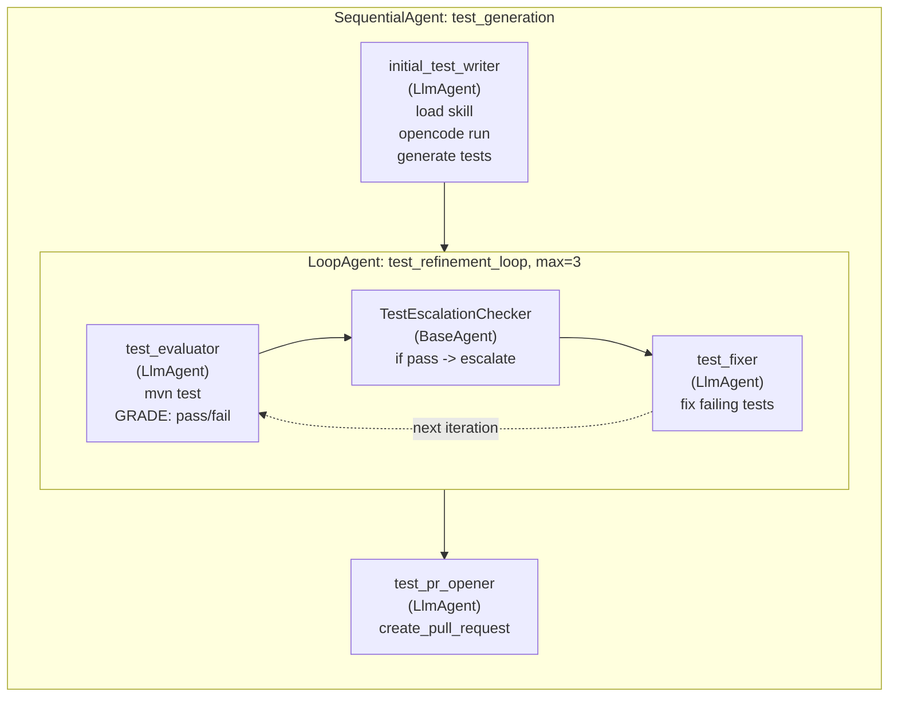

## 6. Fix Validation Pipeline

Multi-persona adversarial review with deterministic consensus scoring.

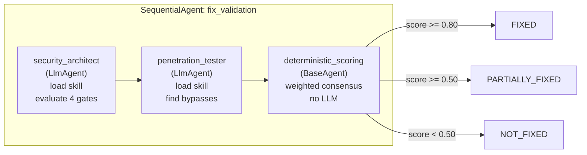

Gate weights: root_cause (0.43), instance_coverage (0.2467), no_new_vulnerabilities (0.1867), security_best_practices (0.1366). Skill instructions use rounded approximations (0.25/0.19/0.13) for LLM readability. Conservative consensus: unanimous agreement = HIGH confidence; disagreement = most-conservative-wins with FLAGGED confidence. Critical gate cap: root_cause not PASS caps decision down one level.

## 7. Policy Gates

Pre-gate and post-gate validation sandwich around the remediation agent.

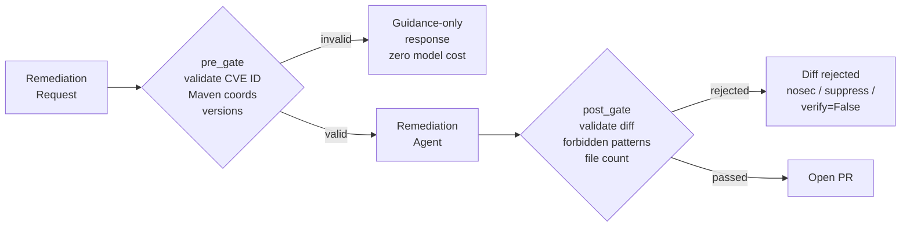

Post-gate enforcement levels: forbidden patterns (nosec, SuppressWarnings, verify=False, etc.) and file count exceeding `MAX_FILES_TOUCHED=5` are **hard rejections** that block the PR. Diff size exceeding `MAX_DIFF_LINES=100` produces a **warning only** (logged but does not reject) — large diffs are flagged for careful review rather than outright blocked.

## 8. Data Flow

How data moves from RHTPA workspace files through agent tools to SCM.

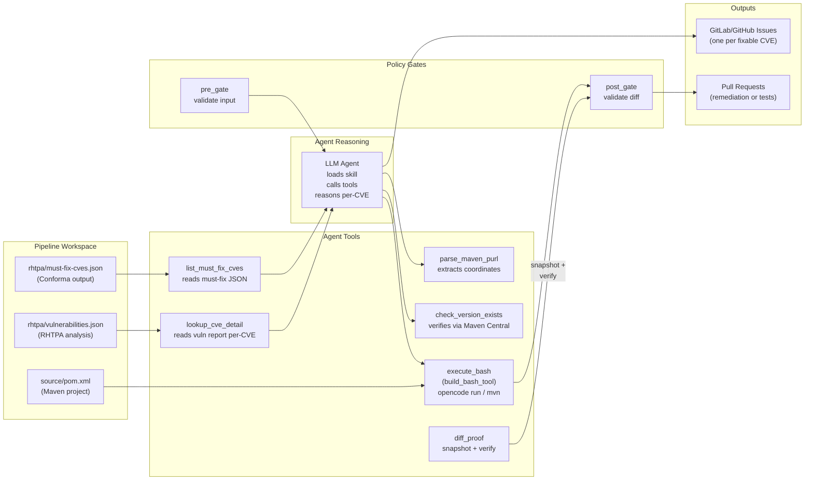

## 9. Automated Evaluation System

Two-layer evaluation system — **fully automated**, no manual intervention needed. Runs on every code change and every 6 hours on a schedule.

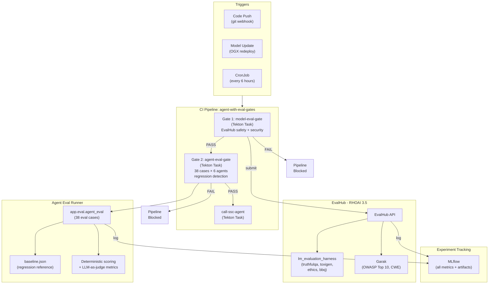

### Layer 1: Model-Level Eval (EvalHub)

Verifies the underlying LLM is safe before any agent runs.

| Benchmark | Provider | Threshold | What it catches |
|-----------|----------|-----------|-----------------|
| truthfulqa_mc1 | lm_evaluation_harness | 0.60 | Hallucination tendency |
| toxigen | lm_evaluation_harness | 0.85 | Toxic output generation |
| ethics_cm | lm_evaluation_harness | 0.75 | Ethical reasoning |
| bbq | lm_evaluation_harness | 0.90 | Bias in ambiguous contexts |
| owasp_llm_top10 | Garak | 0.10 | Prompt injection, jailbreaks |
| cwe | Garak | 0.10 | Code weakness exploitation |
| quality | Garak | 0.10 | Code quality patterns |

### Layer 2: Agent-Level Eval (38 cases across 6 agents)

Verifies each agent behaves correctly with regression detection.

| Agent | Cases | Key metrics tested |
|-------|-------|--------------------|
| Coordinator | 8 | Correct routing, out-of-scope decline, full pipeline orchestration |
| CVE Selection | 7 | Hallucination guard, structured output, skill-first, version verification |
| CVE Analysis | 5 | Multi-CVE handling, issue creation, empty set, duplicate detection |
| Remediation | 7 | Build retry loop, pre/post gate, max retries, skill-first |
| Test Generation | 5 | Compile failure retry, test-only PRs, config change tests |
| Fix Validation | 6 | Gate accuracy, nosec detection, root cause cap, persona consensus |

### Automation guarantees

- **Every code push** triggers the full pipeline via Tekton EventListener
- **Every 6 hours** a CronJob runs evals even with no code changes (catches model drift)
- **Model updates** trigger evals via the webhook EventListener
- **Regression detection** compares each metric against `baseline.json` (tolerance: 10%)
- **Floor enforcement** blocks deploy if any metric falls below its absolute minimum
- **MLflow logging** tracks every eval run for trend analysis
- **Zero manual steps** — `make deploy-eval-tasks` sets up everything on the cluster

### Custom eval metrics (LLM-as-judge)

| Metric | Applies to | What it measures |
|--------|-----------|-----------------|
| `cve_selection_accuracy` | Selection | Did the agent verify versions before deciding? |
| `version_not_hallucinated` | Selection | Every reported version was checked via tool call? |
| `correct_routing` | Coordinator | Delegated to the right sub-agent? |
| `skill_loaded_first` | Selection, Analysis, Remediation | Loaded methodology skill before acting? |
| `tool_use_completeness` | Selection, Analysis | Called all necessary tools? |
| `remediation_build_passes` | Remediation, Test Gen | Build succeeds after changes? |
| `validation_gate_accuracy` | Validation | Gates match expected results? |
| `pr_hygiene` | Remediation, Test Gen | PR is focused, described, no anti-patterns? |

## 10. MLflow Tracing

Full-stack observability via OpenTelemetry + MLflow. Every LLM call, tool execution, and agent delegation is captured as a span and forwarded to RHOAI MLflow.

### Span Architecture

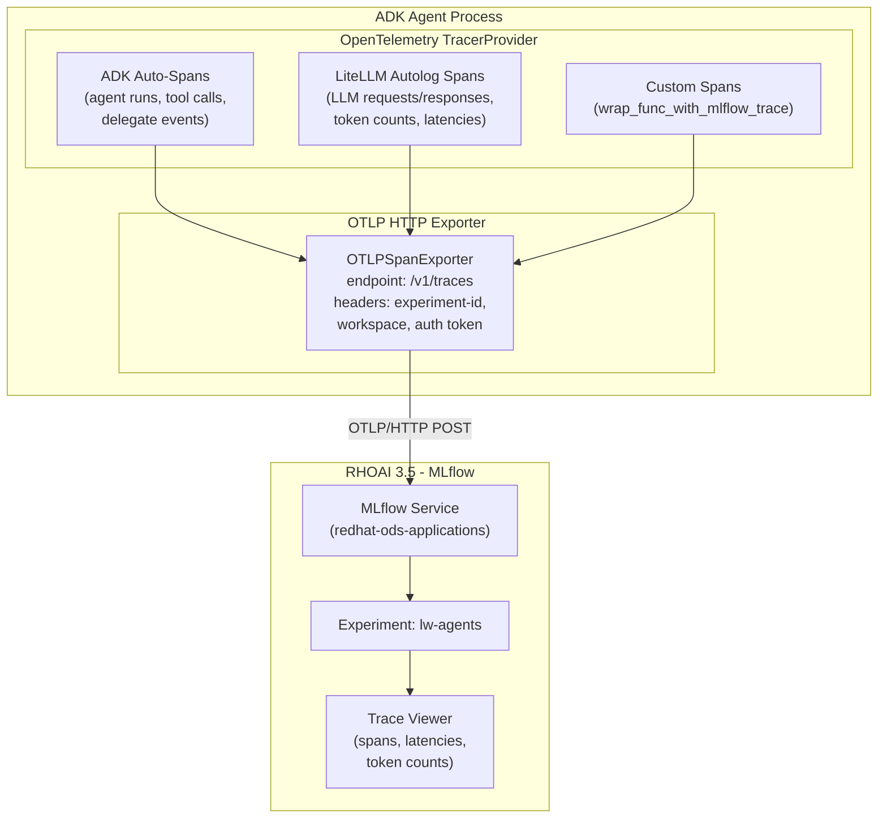

### Span Hierarchy (typical CVE selection run)

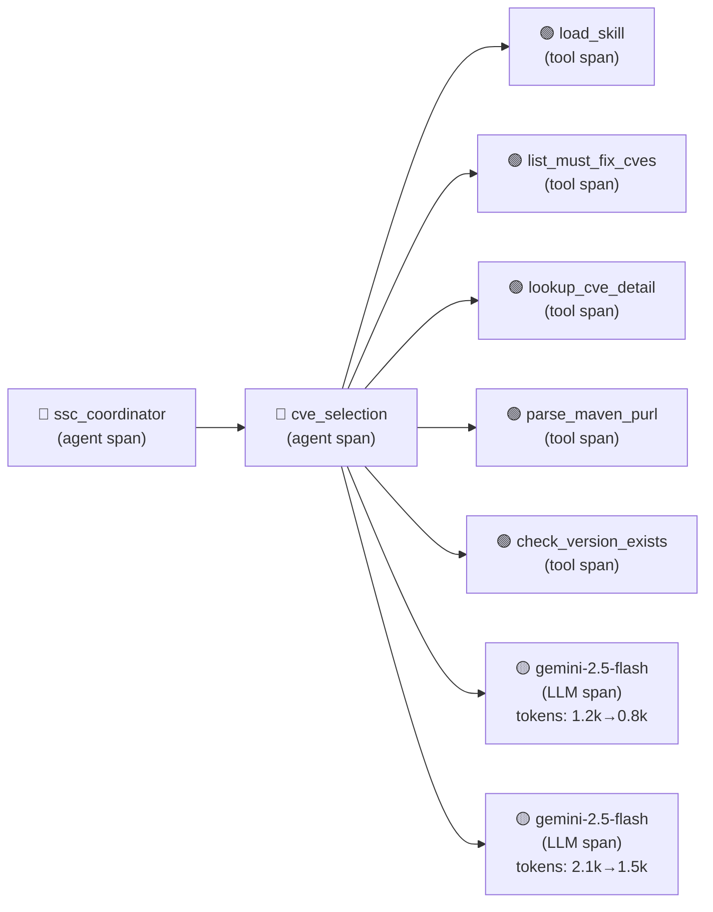

### Bootstrap Sequence

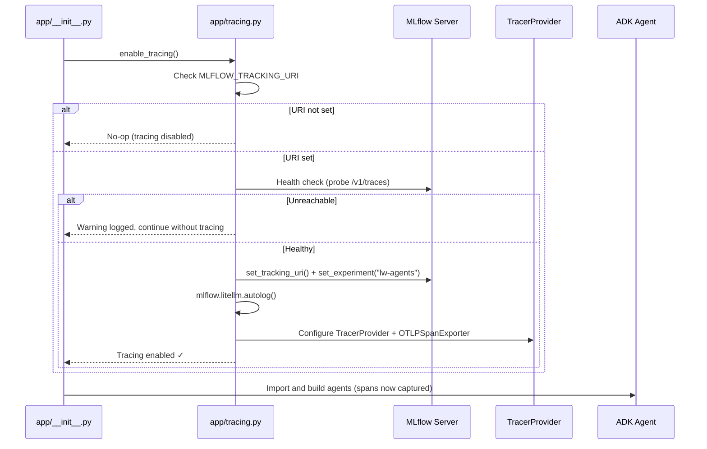

### Configuration

| Env Var | Required | Default | Description |
|---------|----------|---------|-------------|
| `MLFLOW_TRACKING_URI` | Yes (to enable) | — | MLflow server URL |
| `MLFLOW_EXPERIMENT_NAME` | No | `lw-agents` | Experiment name in MLflow |
| `MLFLOW_WORKSPACE` | No | — | RHOAI workspace (maps to K8s namespace) |
| `MLFLOW_TRACKING_TOKEN` | No | — | Bearer token for auth |
| `MLFLOW_TRACKING_INSECURE_TLS` | No | `false` | Skip TLS verification |
| `MLFLOW_HEALTH_CHECK_TIMEOUT` | No | `5` | Seconds to wait for MLflow |

### Key Design Decisions

1. **Opt-in**: Tracing only activates when `MLFLOW_TRACKING_URI` is set
2. **Graceful degradation**: If MLflow is unreachable or deps are missing, agents start normally
3. **Two-layer capture**: OTel (ADK spans) + LiteLLM autolog (LLM call spans) for full coverage
4. **Bootstrap order**: Tracing initializes before any ADK imports to capture all spans
5. **Zero code changes to agents**: Existing agents get full tracing without modification

## 11. Deployment Architecture

How the ADK agent service is deployed on OpenShift alongside Tekton and EvalHub.

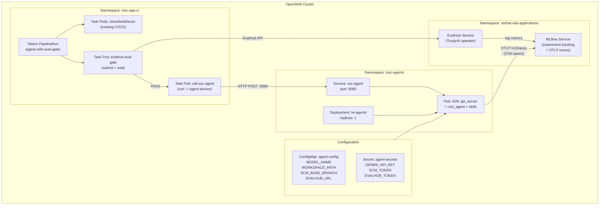

## Architecture Decision Records

See [docs/adr/](adr/) for the full set:

| ADR | Title |
|-----|-------|
| [001](adr/001-agent-framework-selection.md) | Agent Framework Selection (Google ADK on OpenShift) |
| [002](adr/002-agents-and-skills-first.md) | Agents-and-Skills-First Architecture |
| [003](adr/003-opencode-as-coding-agent.md) | OpenCode as Coding Agent |
| [004](adr/004-tekton-calls-agent-via-api.md) | Tekton Calls Agent via API |
| [005](adr/005-orchestration-pattern-selection.md) | Orchestration Pattern Selection |
| [006](adr/006-safety-at-runner-level.md) | Safety at Runner Level |
| [007](adr/007-policy-gates.md) | Policy Gates Before and After the Agent |
| [008](adr/008-multi-persona-validation.md) | Multi-Persona Fix Validation |
| [009](adr/009-output-redaction.md) | Output Redaction at Runner Level |
| [010](adr/010-evalhub-integration.md) | EvalHub Integration for Safety and Quality Gates |
| [011](adr/011-mlflow-tracing.md) | MLflow Tracing via OpenTelemetry |
